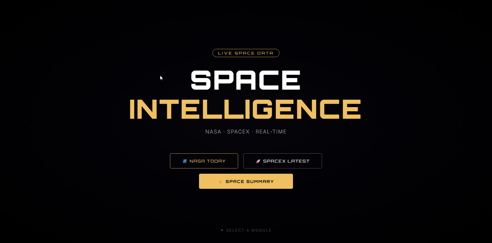
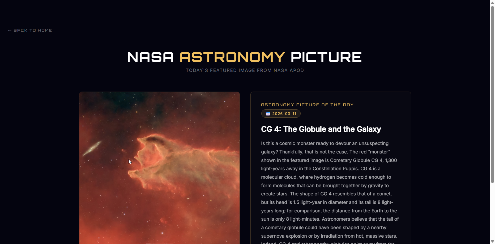
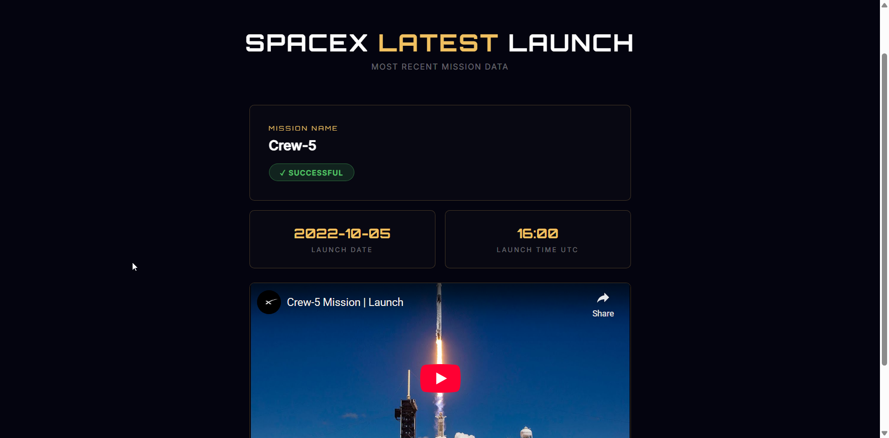
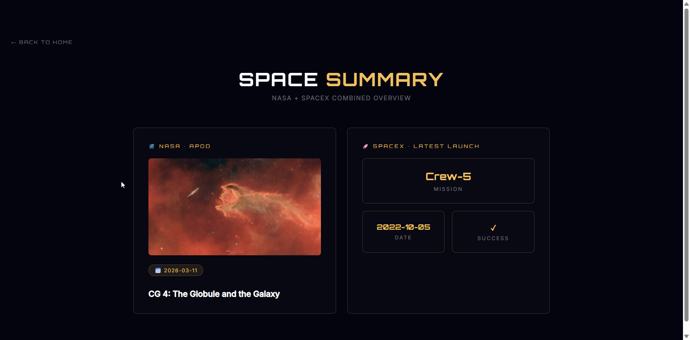

# 🚀 Space Intelligence API

A FastAPI project combining NASA and SpaceX live data with a beautiful dashboard.

## Screenshots

### 🏠 Home


### 🌌 NASA Today


### 🚀 SpaceX Latest


### ⚡ Space Summary


## Endpoints
- `GET /` — Welcome
- `GET /space/today` — NASA Astronomy Picture of the Day
- `GET /spacex/latest` — Latest SpaceX Launch
- `GET /space/summary` — Combined overview
- `GET /dashboard` — Web Dashboard UI

## Setup
```bash
pip install fastapi uvicorn requests python-dotenv jinja2
uvicorn main:app --reload
```

## Tech Stack
- FastAPI · Python · NASA API · SpaceX API